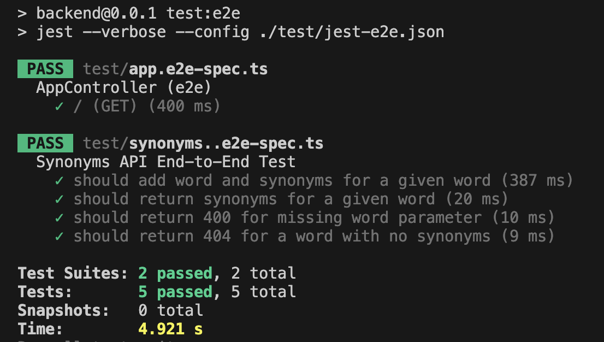

# Find Synonyms Backend Project

## Introduction

This project is the backend service for the Find Synonyms application. It provides APIs for managing products, orders, and user information.

## Synonyms Search Tool

Implement a system that functions as a synonyms search tool with the following features:

- Users can add new words along with their synonyms.
- Users can request synonyms for a word, with lookup working bidirectionally. For example, if "wash" is a synonym for "clean", both words should return each other as synonyms.
- Each word can have multiple synonyms, all of which should be returned upon request.
- Use simple, fast data structures in the backend's memory for storage, with no persistence required.
- The solution is implemented with production-quality code.
- Implement the transitive rule: if "B" is a synonym for "A" and "C" is a synonym for "B", then "C" should also be a synonym for "A".

## Technologies

This project uses the following technologies:

- [NestJS](https://nestjs.com/) - A progressive Node.js framework for building efficient, reliable, and scalable server-side applications.
- [TypeScript](https://www.typescriptlang.org/) - A strongly typed programming language that builds on JavaScript.
- [Vtest](https://jestjs.io/) - A delightful JavaScript testing framework.
- [Swagger](https://swagger.io/) - API documentation. Swagger provides a user-friendly interface to interact with the API endpoints.

## Features

- **Add a new word with its synonyms**

  - **Endpoint:** `POST /api/words`
  - **Description:** Allows you to add a new word along with its synonyms to the database.
  - **Request Body:**
    ```json
    {
      "word": "example",
      "synonyms": ["sample", "instance", "illustration"]
    }
    ```
  - **Response:**
    ```json
    {
      "message": "Word and synonyms added successfully."
    }
    ```

- **Get all synonyms for a word**
  - **Endpoint:** `GET /api/words/{word}`
  - **Description:** Retrieves all synonyms for the specified word.
  - **Response:**
    ```json
    {
      "word": "example",
      "synonyms": ["sample", "instance", "illustration"]
    }
    ```

## Installation

To install and run this project locally, follow these steps:

1. Clone the repository:

```bash
git clone https://github.com/HamidRezaeirad/find-synonyms.git
```

2. Navigate to the project directory:

```bash
cd backend
```

3. Install dependencies:

```bash
npm install
```

4. Set up environment variables:
   Create a `.env` file in the root directory and add the necessary environment variables.

5. Run the application:

```bash
# development
$ npm run start

# watch mode
$ npm run start:dev

# production mode
$ npm run start:prod
```

## Usage

Once the application is running, you can access the API at `http://localhost:3000/api`.

## Testing

To run tests for this project, follow these steps:

1. Ensure all dependencies are installed:

```bash
npm install
```

2. Run the tests:

```bash
# Eslint
$ npm run lint

# unit tests
$ npm run test

# e2e tests
$ npm run test:e2e

# test coverage
$ npm run test:cov
```

## Unit test


## e2e test



## API Documentation

This project uses [Swagger](https://swagger.io/) for API documentation. Swagger provides a user-friendly interface to interact with the API endpoints.

To access the Swagger documentation, navigate to `http://localhost:3000/api-docs` once the application is running.


## Postman docs

You can find the Postman collection in the `docs` folder. This collection contains predefined API requests that you can use to test and interact with our API endpoints.

## License

This project is licensed under the MIT License. See the [LICENSE](LICENSE) file for details.
