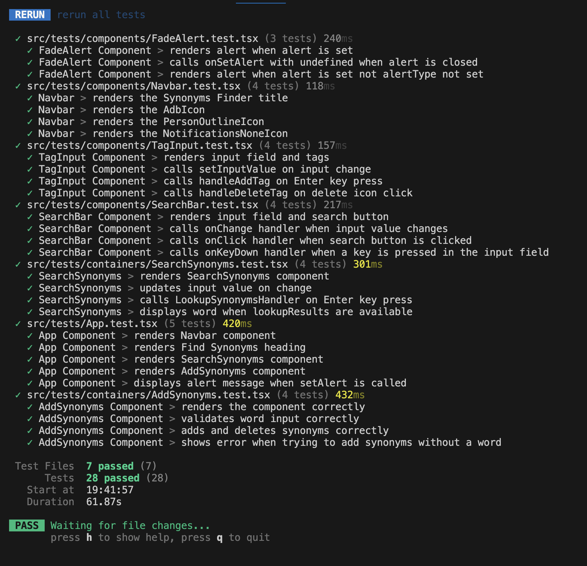

# Find Synonyms Frontend Project

This project is a frontend application built with React.js and TypeScript that implements a synonyms search tool. The tool allows users to add new words with their synonyms and search for synonyms of a given word. The lookup works in both directions and supports transitive rule implementation.

## Features

- **Add Words and Synonyms**: Users can add new words along with their synonyms.
- **Bidirectional Lookup**: Users can search for synonyms of a word, and the lookup works in both directions. For example, if "wash" is a synonym of "clean", searching for either word will return both.
- **Multiple Synonyms**: A word can have multiple synonyms, and all will be returned upon request.
- **Transitive Rule**: If "B" is a synonym of "A" and "C" is a synonym of "B", then "C" will automatically be a synonym of "A".

## Technologies

This project leverages the following technologies:

- **React.js**: A JavaScript library for building user interfaces.
- **TypeScript**: A superset of JavaScript that adds static typing.
- **Vite**: A modern build tool that provides a faster development experience.
- **Vitest**: A fast unit testing framework built on top of Vite.
- **Axios**: A promise-based HTTP client for making API requests.
- **Material-UI**: A popular React UI framework for building responsive and visually appealing user interfaces.

These technologies work together to create a performant, maintainable, and scalable frontend application.

### Vite

Vite is a modern build tool that provides a faster and leaner development experience for modern web projects. It offers:

- **Fast Cold Starts**: Vite uses native ES modules to provide instant server start.
- **Hot Module Replacement (HMR)**: This allows you to see changes in your code instantly without refreshing the page.
- **Optimized Build**: Vite uses Rollup for production builds, ensuring optimized and efficient output.

### Vitest

Vitest is a fast unit testing framework built on top of Vite. It provides:

- **Speed**: Vitest leverages Vite's fast build capabilities to run tests quickly.
- **Integration**: It integrates seamlessly with Vite, making it easy to set up and use in projects that already use Vite.
- **Feature-Rich**: It supports features like snapshot testing, mocking, and coverage reporting.

### TypeScript

TypeScript is a superset of JavaScript that adds static typing to the language. It offers:

- **Type Safety**: Helps catch errors at compile time rather than runtime.
- **Improved IDE Support**: Provides better autocompletion, navigation, and refactoring capabilities.
- **Scalability**: Makes it easier to manage large codebases by providing clear interfaces and type definitions.

### React.js

React.js is a popular JavaScript library for building user interfaces. It provides:

- **Component-Based Architecture**: Allows you to build encapsulated components that manage their own state.
- **Virtual DOM**: Improves performance by minimizing direct manipulation of the DOM.
- **Declarative Syntax**: Makes it easier to reason about your application and manage its state.

These tools and technologies together create a robust, efficient, and scalable environment for developing modern web applications. They enhance development speed, code quality, and maintainability.

## Installation

1. Clone the repository:

```bash
git clone https://github.com/HamidRezaeirad/find-synonyms.git
```

2. Navigate to the project directory:

```bash
cd frontend
```

3. Install dependencies:

```bash
npm install
```

## Usage

1. Start the development server:

```bash
npm run dev
```

2. Run the tests:

```bash
# unit tests
$ npm run test
```

## Unit test



3. Open your browser and navigate to `http://localhost:3001`.

## Project Structure

- `src/`: Contains the source code of the application.
  - `components/`: Reusable React components.
  - `services/`: Services for managing synonyms.
  - `types/`: TypeScript type definitions.
  - `App.tsx`: Main application component.
  - `index.tsx`: Entry point of the application.
